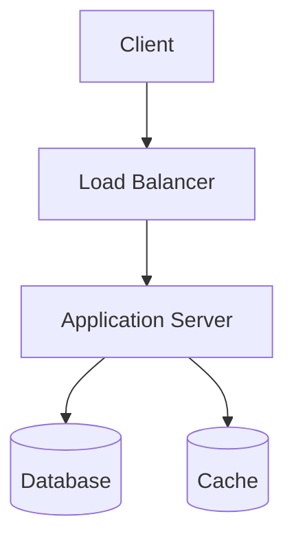

# Architecture Design

**Project**: [Project Name]
**Version**: 0.1
**Date**: [Date]
**Status**: Draft

---

## 1. System Overview

[Purpose and overall structure of the system]

---

## 2. Architecture Diagram

---

## 3. Tech Stack

| Layer | Technology | Version | Rationale |
|-------|-----------|---------|-----------|
| Frontend | | | |
| Backend | | | |
| Database | | | |
| Infrastructure | | | |

---

## 4. Environments

| Env | Purpose | URL |
|-----|---------|-----|
| Development | Developer testing | |
| Staging | QA / UAT | |
| Production | Live service | |

---

## 5. Security Design

-

---

## Change Log

| Version | Date | Changes | Author |
|---------|------|---------|--------|
| 0.1 | [Date] | Initial draft | |
