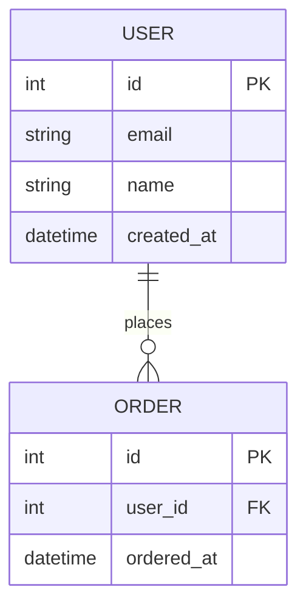

# Database Design

**Project**: [Project Name]
**Version**: 0.1
**Date**: [Date]
**Status**: Draft

---

## 1. ERD

---

## 2. Table Definitions

### users

| Column | Type | Null | Default | Description |
|--------|------|------|---------|-------------|
| id | INT | N | AUTO_INCREMENT | Primary key |
| email | VARCHAR(255) | N | | Email address |
| name | VARCHAR(100) | N | | Display name |
| created_at | DATETIME | N | NOW() | Created timestamp |

<!-- Continue adding tables -->

---

## 3. Indexes

| Table | Index Name | Columns | Type | Purpose |
|-------|-----------|---------|------|---------|
| | | | | |

---

## Change Log

| Version | Date | Changes | Author |
|---------|------|---------|--------|
| 0.1 | [Date] | Initial draft | |
