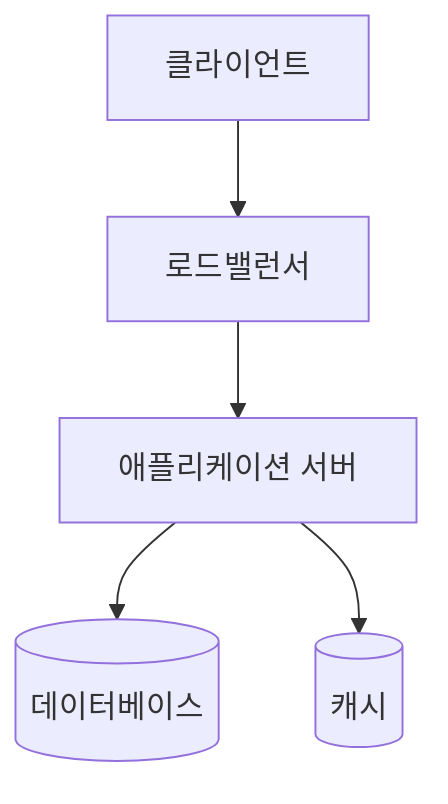

# 아키텍처설계서

## 1. 시스템 개요

[시스템의 목적과 전체적인 구성 설명]

---

## 2. 아키텍처 구성도

---

## 3. 기술 스택

| 레이어 | 기술 | 버전 | 선택 이유 |
|--------|------|------|----------|
| Frontend | | | |
| Backend | | | |
| DB | | | |
| 인프라 | | | |

---

## 4. 배포 환경

| 환경 | 용도 | URL |
|------|------|-----|
| 개발 | 개발자 테스트 | |
| 스테이징 | QA / UAT | |
| 운영 | 실서비스 | |

---

## 5. 보안 설계

-
