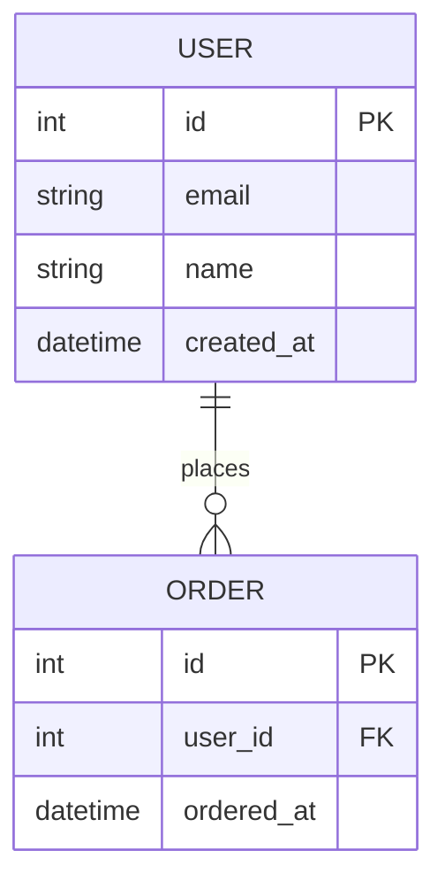

# DB 설계서

**프로젝트**: [프로젝트명]
**버전**: 0.1
**작성일**: [날짜]
**상태**: Draft

---

## 1. ERD

---

## 2. 테이블 정의

### users

| 컬럼명 | 타입 | NULL | 기본값 | 설명 |
|--------|------|------|--------|------|
| id | INT | N | AUTO_INCREMENT | PK |
| email | VARCHAR(255) | N | | 이메일 |
| name | VARCHAR(100) | N | | 이름 |
| created_at | DATETIME | N | NOW() | 생성일 |

<!-- 테이블을 계속 추가하세요 -->

---

## 3. 인덱스 정의

| 테이블 | 인덱스명 | 컬럼 | 타입 | 목적 |
|--------|---------|------|------|------|
| | | | | |

---

## 변경 이력

| 버전 | 날짜 | 변경 내용 | 작성자 |
|------|------|----------|--------|
| 0.1 | [날짜] | 최초 작성 | |
