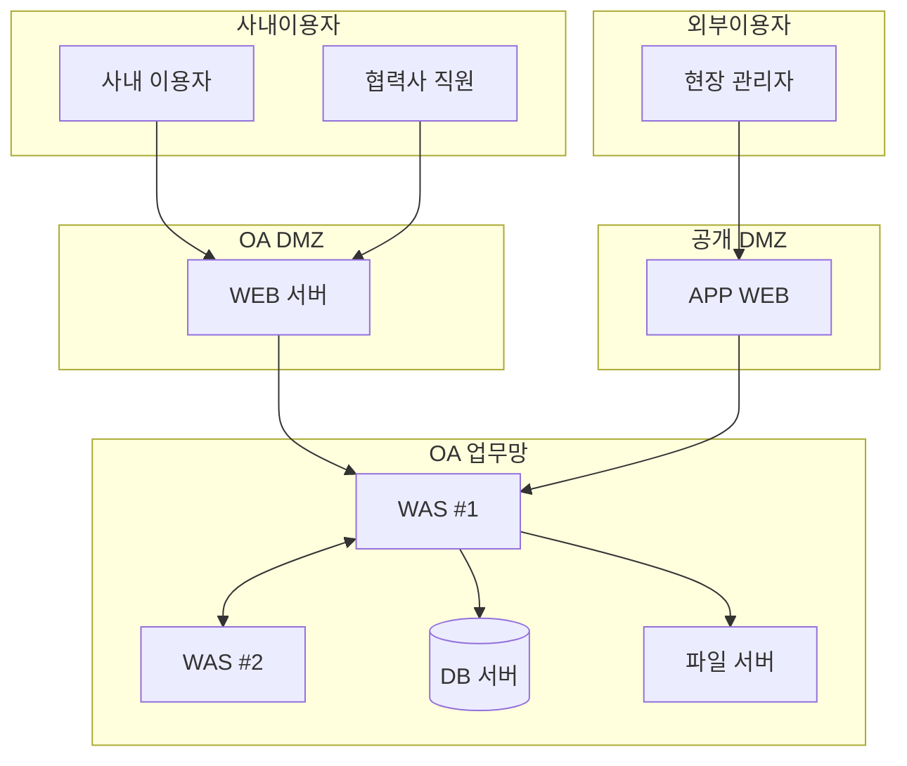
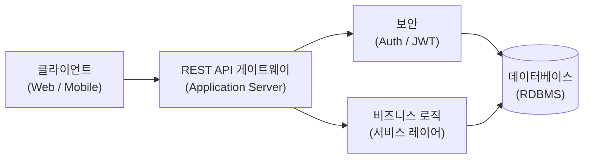

# 시스템아키텍처정의서

## 개정이력

| 버전 | 개정일자 | 개정내역 | 작성자 | 승인자 |
|------|---------|---------|-------|-------|
| 0.1 | {{DATE}} | 최초작성 | | |

---

## 1. 개요

### 가. 범위 및 목표

- [시스템의 목적 및 구축 배경]
- [통합 대상 또는 신규 구축 범위]
- [주요 목표 및 기대 효과]

### 나. 아키텍처 전략

#### 1) 개요

- [통합/신규 구축 방향]
- [핵심 아키텍처 원칙]
- [모바일/웹 전략]
- [데이터 처리 방식]

#### 2) 테크니컬 아키텍처

**가) 하드웨어**

[인프라 환경 설명 — Cloud/On-premise, 자원 할당 기준 등]

**나) 소프트웨어**

[미들웨어 선택 기준 및 오픈소스 정책]

| 운영체제 | 미들웨어 | DBMS |
|---------|---------|------|
| | | |

**다) 네트워크**

[네트워크 구성 정책 — 내부/외부 분리, 방화벽/DMZ 전략 등]

#### 3) 어플리케이션 아키텍처

**라) 계층 구조**

| 계층 | 내용 |
|------|------|
| 프론트엔드 | |
| 백엔드 | |
| 미들웨어 | |
| Database | |

**마) 통신 방식**

- 클라이언트 ↔ WAS:
- WAS ↔ DB:
- 내부 서비스 간:

**바) 보안 및 운영**

- [인증 방식 — SSO/JWT 등]
- [통신 보안 — HTTPS/방화벽]

---

## 2. 테크니컬 아키텍처

### 가. 하드웨어 구성

| 항목 | 서버 모델 | CPU | MEM | 비고 |
|------|---------|-----|-----|------|
| 개발 WAS | | | | |
| 품질 WAS | | | | |
| 운영 WAS #1 | | | | |
| 운영 WAS #2 | | | | |
| WEB (DMZ) | | | | |
| 데이터베이스 | | | | |
| 파일 서버 | | | | |

### 나. 소프트웨어 구성

| 구분 | 품목 | 수량 | 비고 |
|------|------|------|------|
| 개발 WAS | | 1 | |
| 품질 WAS | | 1 | |
| 운영 WAS | | 1 | |
| WEB | | 1 | |
| 데이터베이스 | | 1 | |

### 다. 네트워크 구성

#### 1) 전체 망 구성도

> 복잡한 망 구성은 `images/network-diagram.png` 이미지 파일로 대체 가능

#### 2) 세부 구성도

<!-- 포트 번호 등 세부 정보가 포함된 다이어그램은 이미지로 관리 -->
<!--  -->

[세부 구성 설명]

#### 3) 서버 IP 구성

| 서버명 | REAL IP | VIP | 공인아이피 | 공인VIP |
|--------|---------|-----|----------|--------|
| WAS (개발) | | | | |
| WAS (품질) | | | | |
| WAS #1 (운영) | | | | |
| WAS #2 (운영) | | | | |
| 파일 서버 | | | | |
| DB 서버 | | | | |

---

## 3. 어플리케이션 아키텍처

### 가. 개요

[시스템의 서비스 목표 및 아키텍처 기본 방향]

### 나. 어플리케이션 구성도

#### 어플리케이션 아키텍처 전략

- [모듈화/확장성 전략]
- [기술 선택 기준 — 오픈소스/상용 등]
- [시스템 간 연계 방식]

#### 온라인 처리 아키텍처

**개요**: [사용자 요청 처리 흐름 및 인증/인가 구조 설명]

**처리 흐름**: Client → Application Server → DB Server

**레이어별 역할과 책임**

| 구분 | 내용 |
|------|------|
| Client | 사용자 요청 발송 (Web 또는 Mobile) |
| Application Server | 트래픽 제어, 인증 연계, 비즈니스 로직 처리 및 DB 연동 |
| DB Server | Data 저장 및 조회 처리 |

**구현 매커니즘**

- [인증 방식 — JWT / Spring Security 등]
- [비동기 처리 여부]
- [API 게이트웨이 사용 여부]
