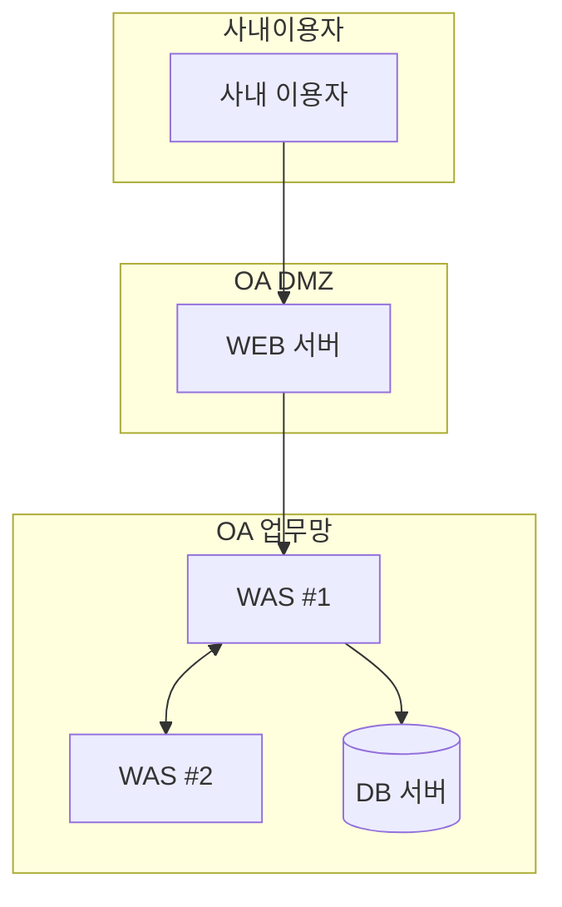
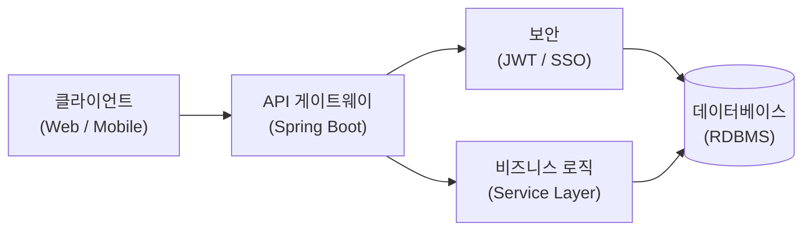

$ARGUMENTS 에 지정된 서브커맨드를 실행한다. 인자가 없으면 사용법을 안내한다.

**사용법**:
- `/specrepo-architecture draft` — RFP + 요구사항 → 아키텍처설계서.md 초안 생성
- `/specrepo-architecture import <file>` — 기존 PDF/docx → MD 구조화
- `/specrepo-architecture export [--format pdf|docx]` — MD → 산출물 파일 생성
- `/specrepo-architecture status` — 현황 확인

---

## 파일 구조

```
skills/specrepo-architecture/
└── data/
    └── 아키텍처설계서-template.md    # 표준 템플릿 (draft 시 Read해서 구조 파악)
```

**프로젝트 내 파일 구조**:
```
references/02-design/
├── 아키텍처설계서.md    ← 진실의 원천 (직접 편집 가능, git 추적)
└── images/              ← 복잡한 다이어그램 이미지 (선택적)
    └── *.png
snapshots/architecture/  ← 내보낸 산출물 (.gitignore 권장)
```

**관리 방식**: MD 단일 파일이 진실의 원천.
- 텍스트/표/단순 다이어그램 → Mermaid 블록으로 MD에 직접 포함
- 복잡한 네트워크 다이어그램 → `images/` 폴더에 PNG로 보관 후 `` 삽입

---

## draft: RFP + 요구사항 → 아키텍처 초안 생성

### 1단계: 입력 문서 파악

아래 순서로 파일을 탐색한다:
1. `references/00-rfp/*/index.md` — RFP 구조화 인덱스
2. `references/00-rfp/*/section-*.md` — RFP 섹션 원문
3. `references/01-requirements/requirements.md` — 요구사항정의서 (있으면 참조)

### 2단계: 아키텍처 초안 작성

RFP와 요구사항에서 다음 정보를 추출해 `아키텍처설계서.md`를 작성한다:

**반드시 채워야 할 항목**:
- `1. 개요 > 가. 범위 및 목표` — RFP에서 사업 목적/범위 추출
- `1. 개요 > 나. 아키텍처 전략` — RFP의 기술 스택/인프라 요건에서 도출
- `2. 테크니컬 아키텍처` — RFP의 HW/SW/네트워크 요건에서 구체화
- `3. 어플리케이션 아키텍처 > 구성도` — Mermaid로 초안 그림 생성

**빈 칸으로 남겨도 되는 항목**:
- 서버 IP 구성 (인프라 설계 확정 후 채움)
- 세부 포트 구성도 (네트워크 설계 확정 후 이미지로 추가)

**다이어그램 작성 규칙**:
- 전체 망 구성도 → `mermaid graph TD` (Zone 단위 표현)
- 어플리케이션 구성도 → `mermaid graph LR` (레이어 흐름)
- 포트 번호 등 세부 정보 포함 시 → `images/` 폴더에 PNG로 따로 관리

### 3단계: 템플릿 기반 작성

`skills/specrepo-architecture/data/아키텍처설계서-template.md`를 Read해서 섹션 구조를 파악한 후, 프로젝트에 맞게 내용을 채워 `references/02-design/아키텍처설계서.md`를 생성한다.

### 4단계: front matter 업데이트

```yaml
status: draft
updated: {오늘 날짜}
based_on:
  requirements: "{requirements.json의 _meta.version}"
```

### 4단계: git commit + draft 태그

```bash
git add references/02-design/아키텍처설계서.md
git commit -m "feat: 시스템아키텍처정의서 초안 작성"
./scripts/tag.sh draft 시스템아키텍처정의서 {version}   # front matter의 version 값
```

---

## import: 기존 문서 → MD 변환

기존에 작성된 아키텍처정의서(PDF/docx)를 MD로 구조화한다.

### PDF 파일인 경우

```bash
# 텍스트 추출 (Node.js pdf-parse 활용)
node -e "
const fs = require('fs');
const pdfParse = require('pdf-parse');
pdfParse(fs.readFileSync('<pdf-file>')).then(d => console.log(d.text));
" > /tmp/arch-extracted.txt
```

추출된 텍스트를 읽어 `아키텍처설계서.md` 구조에 맞게 재구성한다.

### docx 파일인 경우

```bash
# python-docx로 텍스트 추출
uv run --with python-docx python3 -c "
import docx, sys
doc = docx.Document(sys.argv[1])
for p in doc.paragraphs: print(p.text)
" <docx-file> > /tmp/arch-extracted.txt
```

### import 후 처리

1. `/tmp/arch-extracted.txt` 내용을 읽어 MD 섹션으로 재구성
2. 다이어그램 이미지는 `references/02-design/images/`에 복사 후 MD에 링크
3. front matter `status: draft`, `updated` 갱신

**비지원 형식 수신 시**:
| 수신 형식 | 처리 |
|---------|------|
| `.hwp` | 지원 불가. HWP→PDF 변환 후 재시도 안내 |
| `.ppt`, `.pptx` | 지원 불가. 해당 파일에서 내용 복사 후 수동 작성 안내 |
| `.xlsx` | 아키텍처정의서는 MD 형식으로 관리됨. 내용을 텍스트로 추출해 MD로 재작성 안내 |

### git commit + import 태그

```bash
git add references/02-design/아키텍처설계서.md references/02-design/images/
git commit -m "feat: 시스템아키텍처정의서 임포트 v{version} ({source})"
./scripts/tag.sh import 시스템아키텍처정의서 {version}
```

---

## export: MD → 산출물 파일 생성

`아키텍처설계서.md`에서 납품용 파일을 생성한다.

### PDF 내보내기

```bash
# md-to-pdf (scaffold 기본 제공)
./scripts/export-pdf.sh 02-design/아키텍처설계서

# 직접 호출
npx md-to-pdf references/02-design/아키텍처설계서.md \
  --dest snapshots/architecture/
```

### Word(.docx) 내보내기

pandoc이 설치된 경우:

```bash
# 기본 변환
pandoc references/02-design/아키텍처설계서.md \
  -o snapshots/architecture/아키텍처설계서_v{version}.docx

# 커스텀 Word 템플릿 적용 (결재란/로고 포함 공문서 양식)
pandoc references/02-design/아키텍처설계서.md \
  --reference-doc=references/02-design/_template.docx \
  -o snapshots/architecture/아키텍처설계서_v{version}.docx
```

**커스텀 Word 템플릿**: `references/02-design/_template.docx` 파일이 있으면 자동으로 해당 템플릿의 스타일을 적용한다. 없으면 pandoc 기본 스타일로 생성.

> pandoc 설치: `apt install pandoc` (Ubuntu/WSL)

출력 파일 기본 경로: `snapshots/architecture/아키텍처설계서_v{version}_{YYYYMMDD}.{ext}`

---

## status: 현황 확인

`references/02-design/아키텍처설계서.md`의 front matter를 Read해서 다음을 보고한다:

- 버전 (`version`)
- 상태 (`status`)
- 마지막 수정일 (`updated`)
- 기반 요구사항 버전 (`based_on.requirements`)
- 미작성 섹션 (내용이 `[...]` 형태로 남아있는 항목)
- 다이어그램 현황 (Mermaid 블록 수, 이미지 참조 수)

---

## 다이어그램 작성 가이드

### 전체 망 구성도 예시 (Mermaid)



### 어플리케이션 구성도 예시 (Mermaid)



### 복잡한 다이어그램 (이미지 관리)

포트 번호, 서버 박스 배치 등 Mermaid로 표현하기 어려운 경우:

```bash
# 이미지 파일 배치
cp 세부구성도.png references/02-design/images/network-detail.png

# MD에 삽입

```
